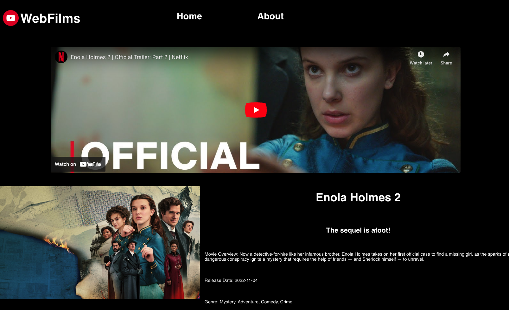

  <h1>WebFilms (Rancid Tomatillos)</h1>

## Overview

Rancid Tomatillos is a React.js application that allows a user to browse through a list of movies, click on the movie cards and view detailed information about the movie. This project is from [Turing School of Software and Design's](https://turing.edu/) Front-end Engineering program and prescribed as a pair project. I graduate from Turing's Back End Engineering program and am self-teaching through the front end curriculum and created [this project](https://frontend.turing.edu/projects/module-3/rancid-tomatillos-v3.html) solo.

# Tech and Tools
- 
- 
- 
- 
- 
- 

<!--  -->

# Iteration 1
- Display all movies from static data

# Iteration 2/3
- Display a single movie - data from API created by Turing Staff  

 

# Possible Next Steps
- Create node.js API for this project using "My Favorites" list via TMDB(The Movie Database), clean data and respond with only my favorite movies
- Refactor styling for single movie information pages
- Add Search functionality in header

  

<a href="https://iconscout.com/icons/movie" class="text-underline font-size-sm" target="_blank">Movie Icon</a> by <a href="https://iconscout.com/contributors/juraj-sedlak" class="text-underline font-size-sm">Juraj Sedlák</a> on <a href="https://iconscout.com" class="text-underline font-size-sm">IconScout</a>

